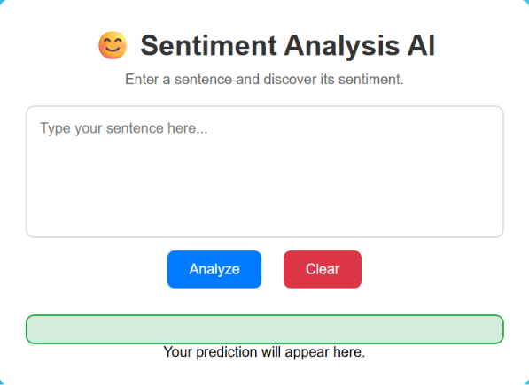
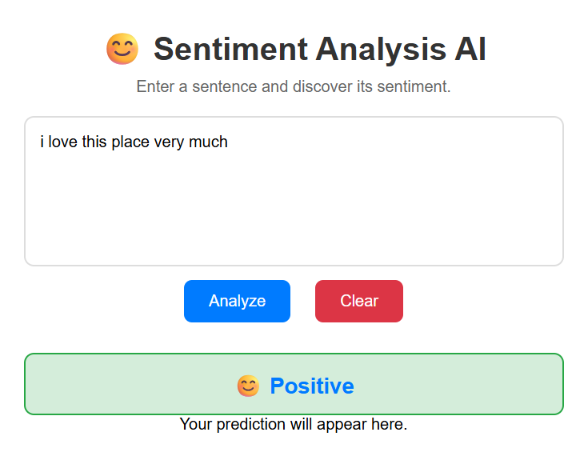
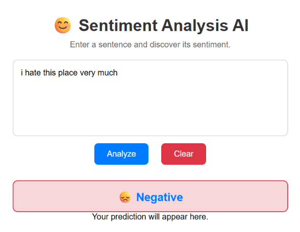
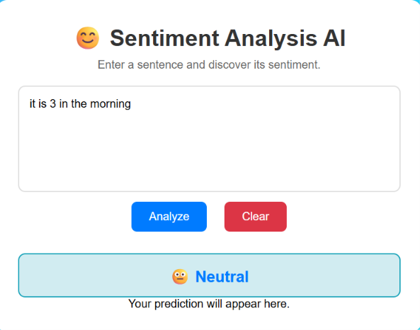

# 😊 Sentiment Analysis Web Application

An end-to-end AI-powered Sentiment Analysis Web Application that predicts whether a user's text expresses a **Positive**, **Negative**, or **Neutral** sentiment. This project demonstrates the complete machine learning workflow, from data preprocessing and model training to deploying a web application using FastAPI and a responsive frontend.

---

## 📌 Project Overview

This application uses a machine learning model trained on a sentiment dataset to classify text into one of three categories:

- 😊 Positive
- 😐 Neutral
- 😞 Negative

Users enter text through a simple web interface, and the application sends it to a FastAPI backend, where the trained model predicts the sentiment and returns the result instantly.

This project was built to understand the complete lifecycle of an AI application, including data preprocessing, feature engineering, model training, backend development, frontend integration, testing, and deployment.

---

## 🚀 Features

- Predicts Positive, Neutral, and Negative sentiments
- User-friendly web interface
- FastAPI REST API backend
- TF-IDF feature extraction
- Machine Learning-based sentiment classification
- Real-time prediction
- Input validation for empty text
- Error handling for API connection issues
- Responsive frontend design
- Easy to deploy and extend

---

## 🛠️ Technologies Used

### Programming Language
- Python

### Machine Learning
- Scikit-learn
- Pandas
- NumPy
- NLTK

### Backend
- FastAPI
- Uvicorn

### Frontend
- HTML5
- CSS3
- JavaScript (Fetch API)

### Model Storage
- Pickle (.pkl)

### Version Control
- Git
- GitHub

---

## 📂 Project Structure

```text
Sentiment-Analysis/
│
├── backend/
│   ├── main.py
│   ├── model.pkl
│   └── vectorizer.pkl
│
├── dataset/
│
├── frontend/
│   ├── index.html
│   ├── style.css
│   └── script.js
│
├── training/
│
├── README.md
├── requirements.txt
└── .gitignore
```

---

## ⚙️ Installation

### 1. Clone the Repository

```bash
git clone https://github.com/seemalm278/Sentiment-Analysis.git
cd Sentiment-Analysis
```

### 2. Create a Virtual Environment

**Windows**

```bash
python -m venv venv
venv\Scripts\activate
```

**Linux/macOS**

```bash
python3 -m venv venv
source venv/bin/activate
```

---

### 3. Install Dependencies

```bash
pip install -r requirements.txt
```

---

### 4. Start the Backend

```bash
cd backend
uvicorn main:app --reload
```

Backend URL:

```
http://127.0.0.1:8000
```

Swagger Documentation:

```
http://127.0.0.1:8000/docs
```

---

### 5. Run the Frontend

Open `frontend/index.html` using **Live Server** in VS Code or run:

```bash
cd frontend
python -m http.server 5500
```

Open:

```
http://127.0.0.1:5500
```

---

## 🔄 Machine Learning Workflow

```text
Dataset
   │
   ▼
Data Cleaning
   │
   ▼
Text Preprocessing
   │
   ▼
TF-IDF Vectorization
   │
   ▼
Model Training
   │
   ▼
Model Evaluation
   │
   ▼
Save Model (.pkl)
   │
   ▼
FastAPI Backend
   │
   ▼
Frontend
   │
   ▼
Prediction
```

---

## 🌐 API Endpoint

### POST `/predict`

#### Request

```json
{
  "text": "I love this project!"
}
```

#### Response

```json
{
  "prediction": "Positive"
}
```

---

## 🧪 Testing

The application has been tested with:

- ✅ Positive sentences
- ✅ Negative sentences
- ✅ Neutral sentences
- ✅ Empty input
- ✅ Long paragraphs

---

## 📊 Model Performance

The trained machine learning model achieved approximately **76% accuracy** on the test dataset.

Evaluation metrics included:

- Accuracy
- Precision
- Recall
- F1-Score
- Confusion Matrix

---


## 📸 Screenshots

### Home Page



### Positive Prediction



### Negative Prediction



### Neutral Prediction



## 🔮 Future Improvements

- Add confidence score for predictions
- Support multiple languages
- Improve model accuracy using advanced NLP models
- User authentication
- Save prediction history
- Dark mode
- Docker containerization
- Cloud deployment

---
Sentiment Analysis Web App is now fully deployed with:

Backend: FastAPI on Railway

Frontend: HTML/CSS/JS on Netlify

Live predictions: Connected via REST API

You can try the Sentiment Analysis Web App here:
👉 Sentiment Analysis Live (boisterous-souffle-eed1e0.netlify.app in Bing)

## 👨‍💻 Author

**Seemal**

AI & Machine Learning Enthusiast

GitHub: https://github.com/seemalm278

---

## 📜 License

This project is developed for educational and portfolio purposes.

Feel free to use, modify, and improve it.

---

## ⭐ Acknowledgements

- Scikit-learn
- FastAPI
- Pandas
- NumPy
- NLTK
- Open Source Community

---

### ⭐ If you found this project useful, consider giving it a star on GitHub!
